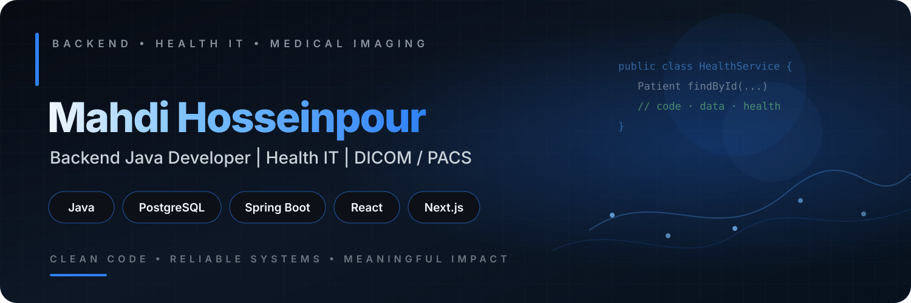

<p align="center">
  
</p>

<div align="center">

[](https://git.io/typing-svg)


</div>

## 👋 About Me

I'm **Mahdi**, a backend-focused software developer working mainly with **Java**, **PostgreSQL**, and API-driven systems.

My main domain is **Health IT**, where I work on **EHR systems, workflow automation, DICOM/PACS, medical imaging, and backend services**.

- ☕ Java backend & REST APIs
- 🗄️ PostgreSQL / JSONB
- 🩺 Health IT / EHR systems
- 🩻 DICOM / PACS development
- ⚙️ Backend architecture & microservices
- 🌐 React / Next.js for end-to-end product delivery

---

## ⚒️ Tech Stack

<div align="center">

[](https://skillicons.dev)

<br/>


</div>

---

## 🚀 Featured Projects

| Project | What it does | Stack |
| --- | --- | --- |
| [**🩻 PACS Viewer**](https://github.com/mahdihp1997/PACS) | Web-based viewer for browsing and rendering DICOM studies | React · Cornerstone · DICOM · REST |
| [**⚙️ PACS Server Backend**](https://github.com/mahdihp1997/pacs-server-backend) | Java PACS/DICOM backend with database integration and APIs | Java 17 · dcm4che · PostgreSQL · Javalin |

---

## 🧩 What I Build

```text
🏥 Health Systems
   ├─ Electronic Health Records
   ├─ Clinical workflow automation
   └─ Reliable backend services

🩻 Medical Imaging
   ├─ DICOM communication
   ├─ PACS infrastructure
   └─ Imaging delivery workflows

⚙️ Backend Engineering
   ├─ Java / Spring services
   ├─ REST API design
   ├─ PostgreSQL / JSONB
   └─ System integration

🚀 Product Delivery
   ├─ React / Next.js
   ├─ Docker / Linux
   └─ Production-minded deployment
```

> From clinical workflow to production — I like turning complex healthcare requirements into software that is reliable, maintainable, and useful.

---

## 📊 GitHub Overview

<div align="center">


</div>

---

<div align="center">

### ☕ Backend Engineering · 🩺 Health IT · 🩻 Medical Imaging

**Build reliable systems. Solve real problems. Keep learning.**

</div>
