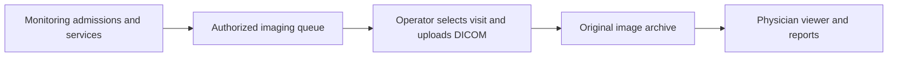

# Davis PACS — DICOM and Monitoring Backend

A Java/PostgreSQL backend for medical imaging archive workflows, authenticated image review, reporting and daily imaging admissions from a health monitoring system.

## Architecture

## Implemented capabilities

- Role-controlled APIs, cookie sessions, CSRF controls and documented MFA/TLS options.
- DICOM archive ingestion/retrieval and declared subsets of DICOMweb and DIMSE services.
- Imaging order workflows, locally scheduled MWL, scoped FHIR interfaces, and documented MPPS/storage commitment behavior.
- Versioned reports, finalization/addenda, critical result workflows and derived document export.
- Admission/service/device validation with database row locking and revision checks inside image association transactions.
- Preservation of original DICOM bytes and identifiers; separate imaging visits and duplicate SOP protection.
- Release manifests, deployment validation, archive checks, backup/recovery and site acceptance tooling.

## Evidence and limits

The last complete local acceptance recorded 46 passing checks, no failed checks and one blocked clinical/test archive gate. The monitoring integration passed 40 native checks in a fresh synthetic schema, including authorization, stale admissions, cancellation locking, original-byte preservation and reporting.

These results are engineering evidence, not a clinical certificate. Real device connectivity, center configuration, diagnostic displays, operational recovery and site sign-off require separate acceptance. The monitoring adapter does not currently provide BPMS single sign-on, automatic legacy service completion or automatic MWL creation from its admission queue.

## Project access

This page presents the project without distributing its implementation. Source access and deployment arrangements are managed separately. It includes no medical records, credentials or runtime configuration.

[Developer profile](https://github.com/mahdihp1997)
